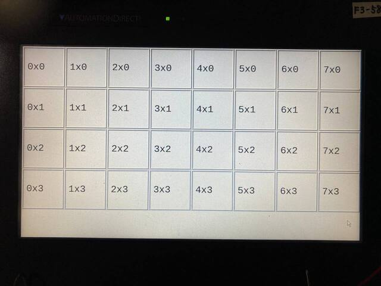
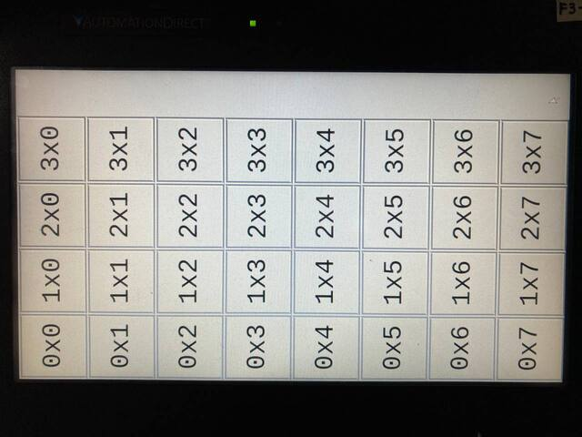
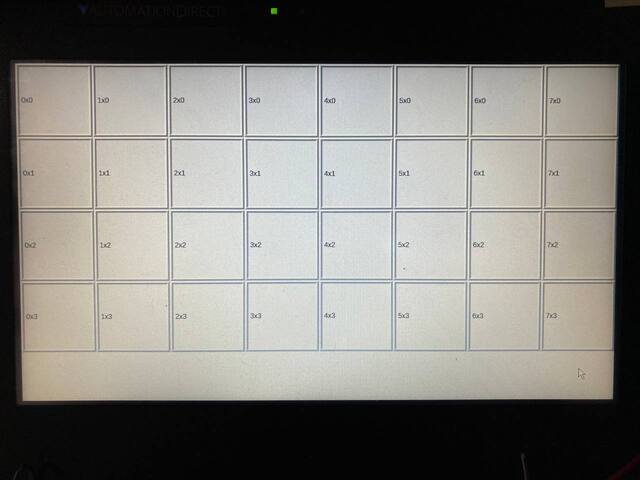
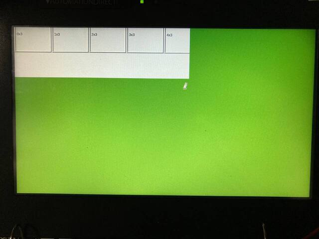

# qtbug-eglfs-rotate-screen

reproduction code for QTBUG-103851

## what is happen ?

When using QWaylandCompositor on EGLFS, setting the screen rotation with QT_QPA_EGLFS_ROTATION does not draw the screen correctly.

For example, for a 1024x600 screen, setting the following environment variables...
* QT_QPA_PLATFORM=eglfs
* QT_QPA_EGLFS_ROTATION=90

Using QWidget on EGLFS, it is fine.
* the size of window is 600x1024 at full-screen.
* Mouse cursor image rotates. Aspect ratio is 1:1.
* The movable range of the mouse cursor is (0, 0)-(1024, 600) (in the coordinate system before rotation)
* The display origin of the window becomes (0, 600) (in the coordinate system before rotation)
* Display content rotates 90 degrees CCW.

However, when using the QWaylandCompositor,
* Mouse cursor image rotates. But the aspect ratio is not 1:1.
* The movable range of the mouse cursor is (0, -424)-(600, 600) (in the coordinate system before rotation)
* The display origin of the window becomes (0, -424) (in the coordinate system before rotation)

At least I think it's strange that the origin after rotation is outside the screen.  
Also, shouldn't the movable range of the mouse be the same as Widget application ?

On the other hand, the following is the specification of the display system, so it is not a problem, I think.
* Since it is an OpenGL application, the display contents are not rotated.

## Related Links
- [QTBUG-103851](https://bugreports.qt.io/browse/QTBUG-103851) Wayland compositor with QT_QPA_EGLFS_ROTATION shows window out of alignment
- [Qt for Embedded Linux, Platform Plugins for Embedded Linux Devices](https://doc.qt.io/qt-5/embedded-linux.html#platform-plugins-for-embedded-linux-devices)

## Code
* minimal-cpp (QtWayland example, but edited)
  * The wayland compositor based QWaylandCompositor.
  * Fixed the display position of the child window from random to (0, 0)
* widgetMatrix
  * QWidget based application.
    * Default widget size is 1024x600.
  * Draw blocks which size is 128x128. However, if it goes out of the window area, do not.

### How to test
Tested with
* Qt 5.15.10
* i.MX8 with 1024x600 LCD

1. Widget application is fine. 
```bash
$ QT_QPA_PLATFORM=eglfs QT_QPA_EGLFS_ROTATION=0 widgetMatrix
```


2. with rotation, Widget application is fine. 
```bash
$ QT_QPA_PLATFORM=eglfs QT_QPA_EGLFS_ROTATION=90 widgetMatrix
```


3. Displaying QWaylandCompositor without rotation is fine.
```bash
$ QT_QPA_PLATFORM=eglfs QT_QPA_EGLFS_ROTATION=0 minimal-cpp &
$ QT_QPA_PLATFORM=wayland widgetMatrix
```


4. Try displaying QWaylandCompositor with rotation. 
```bash
$ QT_QPA_PLATFORM=eglfs QT_QPA_EGLFS_ROTATION=90 minimal-cpp &
$ QT_QPA_PLATFORM=wayland widgetMatrix
```
* the child window whose position is (0,0), is displayed but partly. it seems the origin is gone the out of screen.
* the aspect ratio of the mouse cursor is not 1:1.
* if the user moves Mouse down, the cursor will move to left (because of rotate), and stop at the green area.

